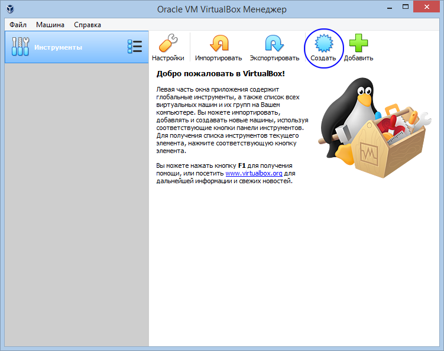
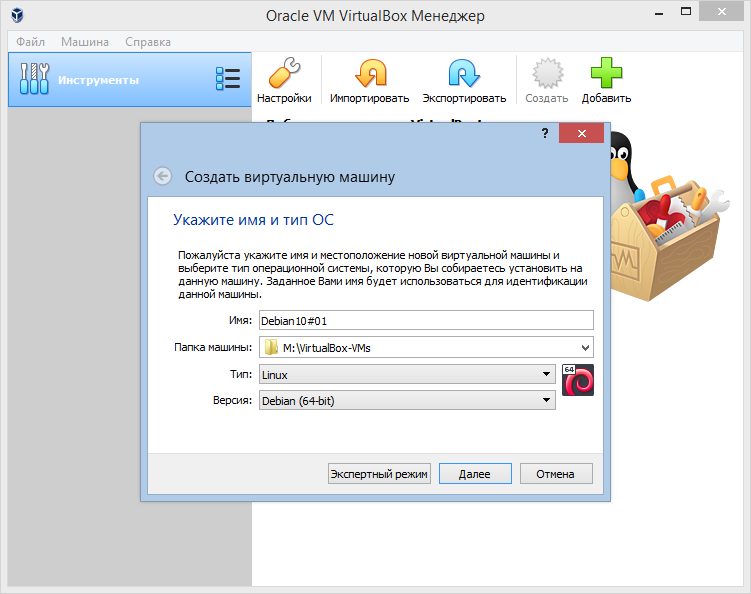
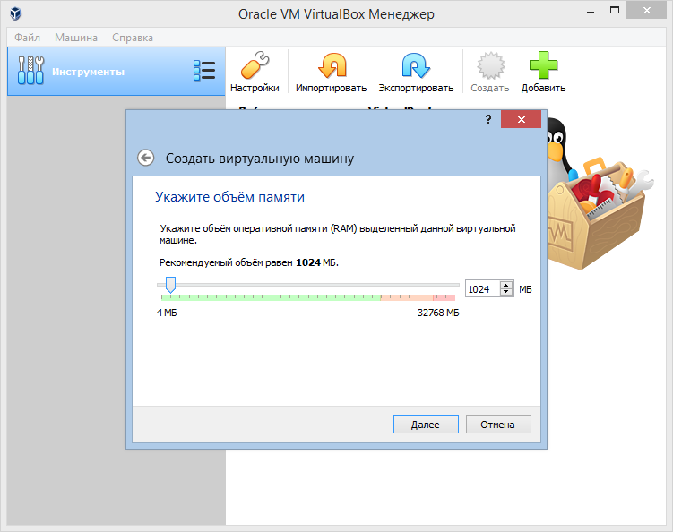
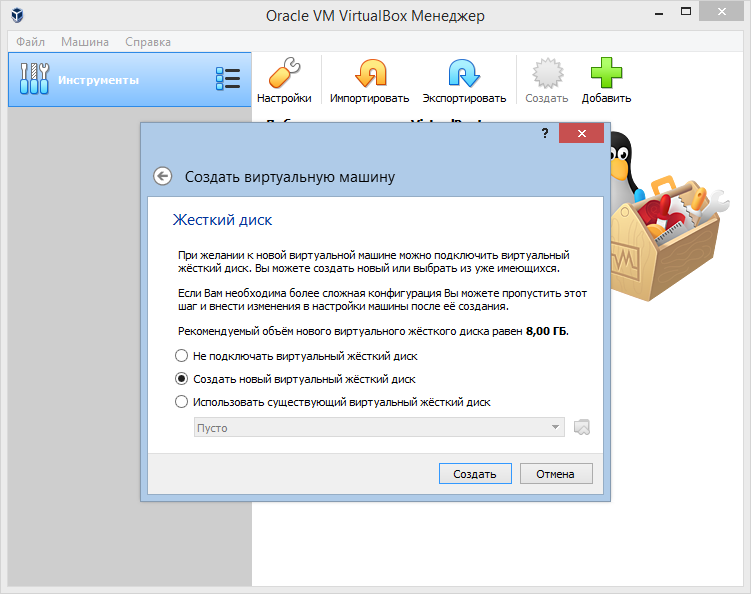
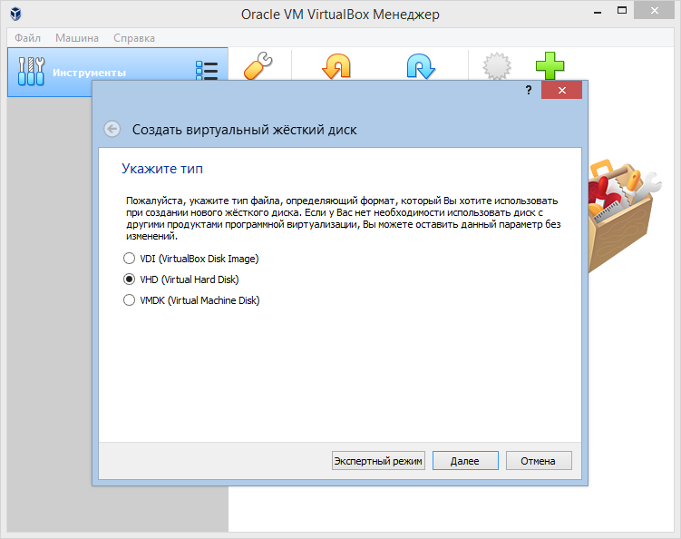
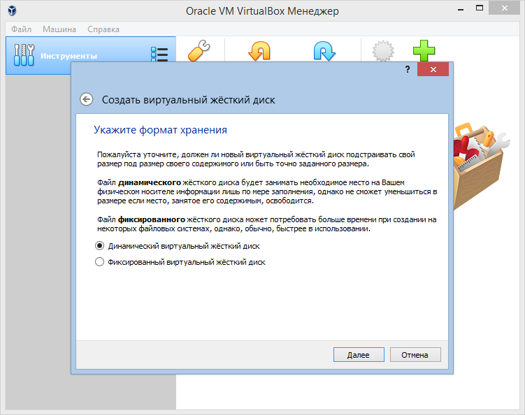
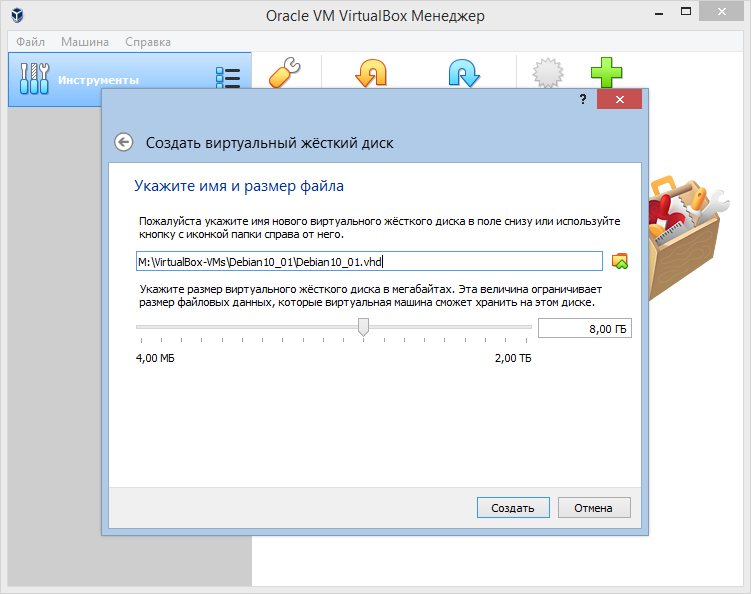
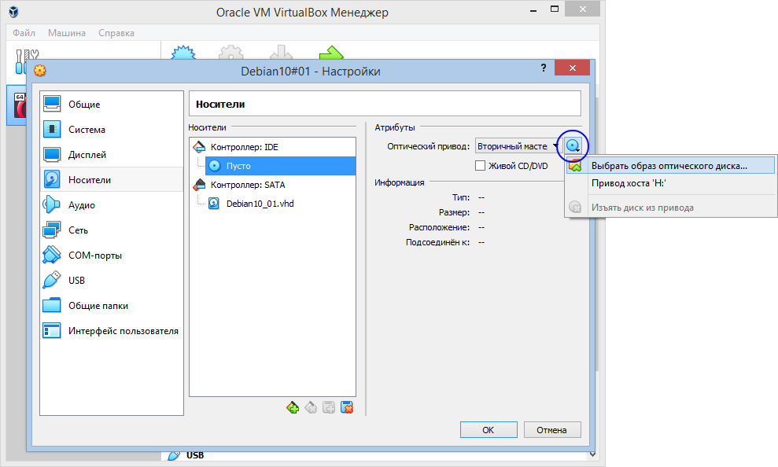

## Inicializaciya ustanovki Debian v Oracle VirtualBox

**01.** Vybiraem punkt `Sozdat`.

**02.** Zadayom nazyanie virtual'noj mashine, papku v kotoroj budut hranitsya fajly virtualki (obraz diska, snapshoty i t.p.).

**03.** Zadayom razmer operativnoj pamyati dlya virtual'noj mashiny (dostatochno 768Mb).

**04.** Ukazyvaem, chto nuzhno sozdat' chistyj (novyj) zhestkij disk pod virtualku. 

**05.** Zadayom tip fajla (format) virtual'noj mashiny. VHD -- predpochtitelen, esli posle planiruetsya perenosit' virtualku na \"boevoj\" server s Hyper-V.

**06.** Zadyom, chto nuzhen dinamicheskij virtual'nyj disk (tak razmer fajla pod virtual'nyj disk budet minimal'ym).

**07.** Zadayom razmer diska virtual'noj mashine -- 8Gb.

**08.** Vybiraem `Nastroit'`

**09.** Vybiraem `Nositeli`, chtoby smontirovat' iso-obraz ustanovochnogo diska Debian kak ustrojstvo CD

**10.** Ukazyvaem, mesto raspolozheniya iso-obraza

**11.** Ubezhdaemsya, chto v kachestve vtorichnogo mastera IDE ukazan iso-obraz ustanovochnogo diska Debian i zapuskaem virtual'nuyu mashinu knopkoj `Zapustit'`. 

